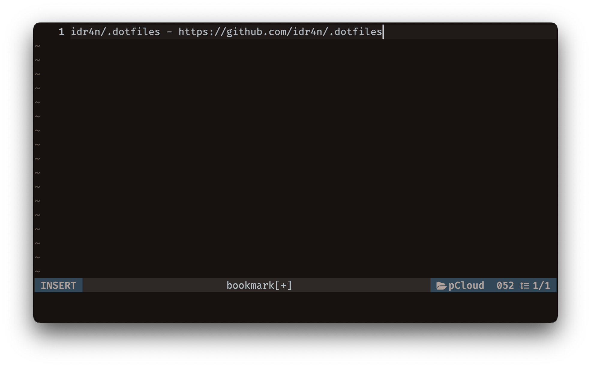
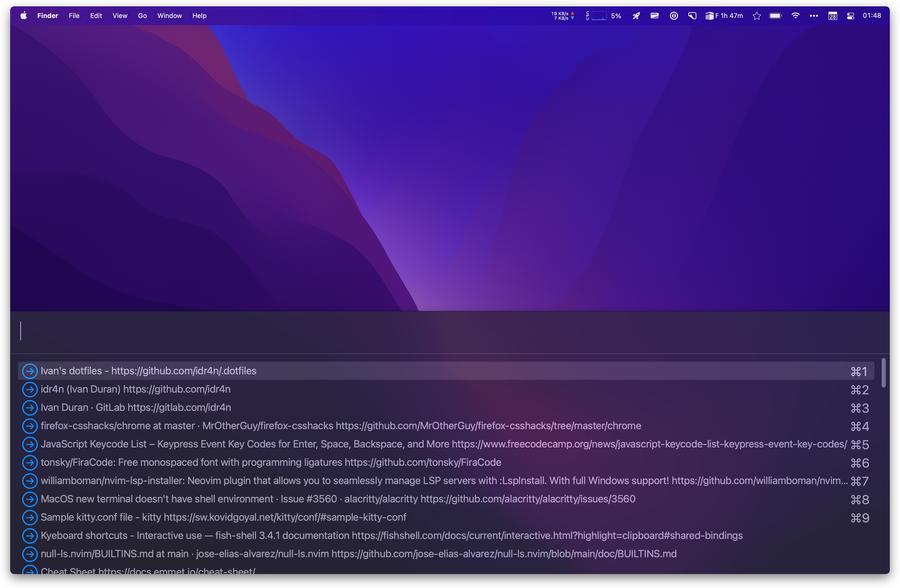

# Dotfiles

This is a repo of my main dot and config files, applicable mainly to MacOS.

Includes a folder with scripts for automation of some tasks (although some of them are not well maintained). This scripts are normally mapped to some keybinding using skhd ([koekeishiya/skhd: Simple hotkey daemon for macOS](https://github.com/koekeishiya/skhd)) or in Neovim ([neovim/neovim: Vim-fork focused on extensibility and usability](https://github.com/neovim/neovim)).

## Basic setup


- Main terminal: Alacritty (and Kitty), normally running Tmux.
- Font used in terminal: [tonsky/FiraCode](https://github.com/tonsky/FiraCode) (at the moment).
- Main editor: Neovim (see my config at [idr4n/nvim-lua](https://github.com/idr4n/nvim-lua)). I also use Sublime Text, and rarely VSCode.
- Window manager: [Hammerspoon](http://www.hammerspoon.org/). I also use a MacOS app called [Rectangle](https://rectangleapp.com/).

## Hammerspoon setup

Hammerspoon is an amazing tool for MacOS. I have used it for several years and I can't live without it.

Besides setting up shortcuts to position my windows, I also use the built-in '[chooser](http://www.hammerspoon.org/docs/hs.chooser.html)' to search for data inside any configured list. I use this feature mainly to search for my bookmarks very fast. I also use it to search for a list of tasks.

### Bookmarks workflow

I don't store my bookmarks in the browser. I gave up on that long time ago and also other apps available don't fulfill my needs.

What I do is to store all my bookmarks in a local file. Whenever I want to save one, I copy the title and url (there are different ways to do that with a simple shortcut), and then I trigger the script '[save_bookmark](https://github.com/idr4n/.dotfiles/blob/master/scripts/save_bookmark)' with a shortcut (configured in skhd), which opens an instance of Alacritty and allows me to paste the title and url and any other information that I want. The important thing is to enter all the information in a single line (so I can search for it with Hammerspoon's chooser). The script then appends the bookmark in a local file.

 

Then, whenever I want to search for a bookmark, I trigger a Hammerspoon shortcut to run '[bookmar_choose.lua](https://github.com/idr4n/.dotfiles/blob/master/.hammerspoon/bookmark_chooser.lua)' which allows me to search for any information saved and upon hitting enter, it will open the url in the default browser.

 

I was using a similar workflow in Linux with Rofi, and so I wanted something similar in MacOS as well. I used Linux and different tiling window managers for sometime, and the experience was good, but I ended up going back to MacOS just because I find it more suitable for my needs, the apps available, and the ability to use 4K external monitors (Linux does not handle high resolution external monitors very well based on my experience). Dmenu or Rofi are one of the things that I miss the most from Linux, but fortunately Hammerspoon came to the rescue with something similar (although not as powerful).

## Tmux

I use Tmux most of the times when using the terminal. I have a skhd shortcut to open Alacritty or Kitty and start a named session in Tmux. The shortcuts looks something like this:

```sh
# open terminal and attach to Tmux session
alt - t: alacritty --working-directory ~/ -e tmux new-session -A -s W
alt + shift - t: kitty -d ~/ tmux new-session -A -s W
```

For Alacritty, however, I use a Hammerspoon shortcut that triggers a custom function that controls a bit better the size of the Alacritty's window as, unfortunately, Alacritty does not remember the size of the window when you close it (Kitty does).

This is the Hammerspoon shortcut for that:

```lua
hs.hotkey.bind({ "alt" }, "t", function()
	h.open_alacritty("tmux new-session -A -s W")
end)

```

## Auto-switch dark/light mode in Alacritty and Kitty

The scripts folder includes a Python script that is automatically triggered when the system changes appearance mode ([change_dark_mode.py](https://github.com/idr4n/.dotfiles/blob/master/scripts/change_dark_mode.py)).

https://user-images.githubusercontent.com/20104703/170837256-078c2b66-a1dc-4715-81f7-e7c89bb208cb.mp4

Unfortunately, it is not a very straight forward process. I mostly follow ['Automatic dark mode for terminal applications'](https://arslan.io/2021/02/15/automatic-dark-mode-for-terminal-applications/) instructions, with the difference that I didn't implement an automatic switch for vim/neovim, and the script is written in Python, rather than in fish/bash. 

This mainly depends on ['bouk/dark-mode-notify'](https://github.com/bouk/dark-mode-notify) swift program that will 'run a command whenever the dark mode status changes on macOS', in my case, it runs the Python script.

This script also depends on a Python package ['darkdetect'](https://pypi.org/project/darkdetect/), which should be installed with `pip`, to detect which mode the system is currently on (light or dark), and run some stuff based on that. 

For Neovim, I just use a Lua function that sets the theme based on a specific time interval. It is quite simple, but the drawback is that it only runs when I start Neovim. Therefore, if the mode change takes effect while in a Neovim session, I have to quit and start Neovim for it to take effect. For me, this is sufficient enough.

