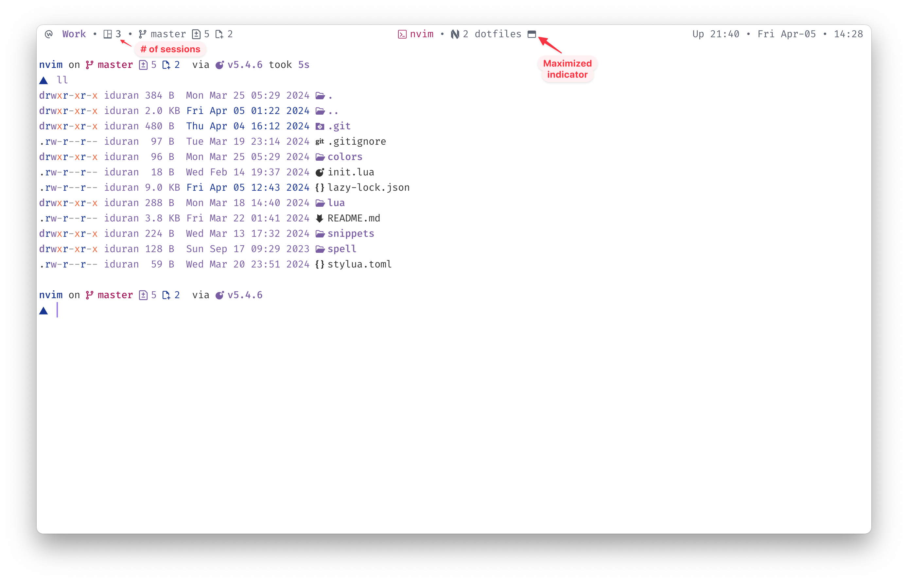

# Dotfiles

These are my main dot and config files, applicable mainly to MacOS.

Includes a folder with scripts for automation of some tasks. This scripts are normally mapped to some keybinding using [skhd](https://github.com/koekeishiya/skhd) or in [Neovim](https://github.com/neovim/neovim).

## Basic setup

- Main terminal: Alacritty and [WezTerm](https://github.com/idr4n/wezterm) (Kitty as a third option), normally running Tmux.
- Shell: Zsh (zim as plugin manager and powerlevel10k as prompt).
- Font used in terminal: [tonsky/FiraCode](https://github.com/tonsky/FiraCode) (Nerd Fonts version).
- Main editor: Neovim (see my config at [idr4n/nvim-lua](https://github.com/idr4n/nvim-lua)).
- Window manager: [Hammerspoon](http://www.hammerspoon.org/). I also use a MacOS app called [Rectangle](https://rectangleapp.com/).

### Bookmarks workflow

I don't store bookmarks in the browser. I gave up on that long time ago and also other apps available don't fulfill my needs.

What I do is to store all my main bookmarks in a local file. Whenever I want to save one, I copy the title and url (there are different ways to do that with a simple shortcut), and then I trigger the script '[save_bookmark](https://github.com/idr4n/.dotfiles/blob/master/scripts/save_bookmark)', which opens an instance of Alacritty and allows me to paste the title and url and any other information that I want. The script then appends the bookmark in a local file. Then, whenever I want to search for a bookmark, I use `fzf` in a terminal instance.

## Tmux

This is my Tmux configuration which adds some icons automatically to sessions and windows, as well as indicators for how many sessions are currently running, and whether a pane is maximized or not. I also use several scripts to manage sessions and windows to open them using `fzf` and `zoxide`.

## Auto-switch dark/light mode in Neovim, Alacritty and Kitty

https://github.com/idr4n/.dotfiles/assets/20104703/73eae2ac-c31e-49d3-9c56-842f6d39dde9

The scripts folder includes a Python script that is automatically triggered when the system (macOS) changes appearance mode ([change_dark_mode.py](https://github.com/idr4n/.dotfiles/blob/master/scripts/change_dark_mode.py)).

I mostly follow ['Automatic dark mode for terminal applications'](https://arslan.io/2021/02/15/automatic-dark-mode-for-terminal-applications/) instructions, with a different implementation for Neovim, and the script is written in Python, rather than in fish/bash. 

This mainly depends on ['bouk/dark-mode-notify'](https://github.com/bouk/dark-mode-notify) swift program that will 'run a command whenever the dark mode status changes on macOS'.

This script also depends on a Python package ['darkdetect'](https://pypi.org/project/darkdetect/), which should be installed, to detect which mode the system is currently on (light or dark), and run some logic based on that. 

For Neovim, I use this [script](https://github.com/idr4n/.dotfiles/blob/master/scripts/nvim_change_colorscheme) to reload the corresponding color scheme in all opened instances of Neovim using the `--sever` and `--remote-send` options, as well as reloading highlights and status line.

